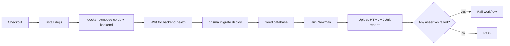

# CI/CD Pipeline

Continuous integration runs the full API test suite against a real, dockerized
backend on every push and pull request.

Workflow: [`.github/workflows/api-tests.yml`](../.github/workflows/api-tests.yml)

## Triggers

- `push` (any branch)
- `pull_request`

Concurrent runs on the same ref are cancelled (`cancel-in-progress`), and the
job has a 15-minute timeout.

## Pipeline steps



1. **Checkout** the repository.
2. **Install dependencies** (`npm ci`) — provides Newman + reporters.
3. **Start Docker Compose** (`db` + `backend`, with build).
4. **Wait for backend availability** by polling `/api/health`.
5. **Run database migrations** (`prisma migrate deploy`).
6. **Seed the database** for a deterministic dataset.
7. **Confirm the backend is serving.**
8. **Run Newman** (`npm run test:api`).
9. **Upload reports** (`newman-report.html` + `.xml`) as build artifacts
   (retained 30 days), even on failure.
10. **Fail the workflow** if any assertion fails (Newman's non-zero exit code).

Backend logs are dumped on failure, and the stack is torn down
(`docker compose down -v`) at the end.

## Running the pipeline locally

With [`act`](https://github.com/nektos/act) (requires Docker):

```bash
act -j api-tests
```

Or reproduce it manually:

```bash
docker compose up -d --build db backend
# wait for http://localhost:8080/api/health
npm ci
npm run test:api
```

## Reading results

- The **Actions** tab shows the run and the JUnit test summary.
- Download the **newman-reports** artifact for the full HTML report.
